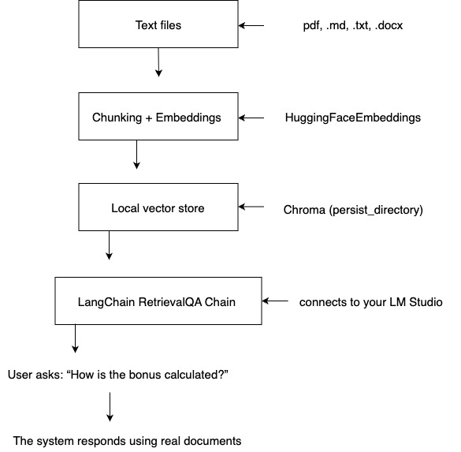

# RAG Agent Local

This project aims to build a reliable internal AI assistant for companies — capable of answering real questions based on internal documentation, without hallucinations.

It transforms a basic LLM setup (`llm-agent-local`) into a full **Retrieval-Augmented Generation (RAG)** pipeline using **LangChain** and a **locally running Mistral 7B** model via **LM Studio**.

The goal is to support enterprise Q&A use cases, enable customization for different domains, and prepare for future fine-tuning of the model on proprietary data.

## Final Goal:

Build an agent that uses internal documents as the source of truth, enabling accurate queries to a local LLM using LangChain, embeddings, and a vector store.

## General architecture of the RAG system

This diagram shows how documents are processed and used to generate grounded answers via a local LLM:

<p align="center">
  
</p>

### 📊 ASCII Diagram (Text View)

This ASCII diagram represents the main components and flow of the `rag-agent-local` architecture. It provides a quick overview of how the system processes a user's question and returns an answer based on internal documents and a local LLM.
                        +---------------------+
                        |     End User        |
                        | (input: question)   |
                        +----------+----------+
                                   |
                                   v
                        +----------+----------+
                        |   RAG Agent (CLI)   |
                        | (ReAct loop logic)  |
                        +----------+----------+
                                   |
              +--------------------+--------------------+
              |                                         |
              v                                         v
   +----------+----------+                 +------------+-------------+
   |  Vector Database    |                 |  LM Studio (Local LLM)   |
   |  (retrieval index)  |                 |  mistral-7b-instruct     |
   +----------+----------+                 +------------+-------------+
              |                                         ^
              v                                         |
 +------------+-------------+               +-----------+-----------+
 |  Retrieved Documents     |   prompt +    | LLM generates response |
 |  (relevant context)      |   context --->| (Thought, Action...)   |
 +------------+-------------+               +------------------------+
                                   |
                                   v
                        +----------+----------+
                        | Final Answer + Log  |
                        +---------------------+


## Tech Stack

- Python 3.10+
- LangChain
- Mistral 7B via LM Studio
- ChromaDB
- HuggingFace Embeddings (all-MiniLM-L6-v2)
  
## Project Structure

```
rag-agent-local/
├── rag_agent.py # Main script to run the QA system locally.
├── data/ # Text files used for indexing (e.g. company_policies.txt)
├── db/ # Auto-generated Chroma vector store (ignored by Git)
├── README.md # Project description and usage
├── images/
|     └── diagram.jpg
└── requirements.txt # Python dependencies.
```

## Setup Instructions

1. **Clone the repository:**
```bash
git clone git@github.com:scarrera03/rag-agent-local.git
cd rag-agent-local
```

2. Create virtual environment (optional but recommended):
```bash
python3 -m venv venv
source venv/bin/activate
```

3. Install dependencies:
```bash
pip install -r requirements.txt
```

4. Start LM Studio and make sure:

- You have a model like mistral-7b-instruct loaded.

- LM Studio is listening on http://localhost:1234.
  
5. Run the agent:
```bash
python rag_agent.py
```
You’ll see:
```pgsql
🤖 RAG Agent ready. Type a question or 'exit' to quit.
```

## How it works

- Loads documents from data/

- Splits text into chunks

- Generates embeddings with sentence-transformers

- Stores vectors in a Chroma DB (db/)

- Uses ChatOpenAI with a local endpoint (LM Studio) to answer based on retrieved content
  
## Business Use Case
Designed for internal Q&A over company documents — replacing keyword search with conversational AI grounded in actual data.

## Notes
- The folder db/ (Chroma vector DB) is ignored in version control. It is rebuilt automatically when you run the script.
- The script uses data/company_policies.txt as a sample document

## License
MIT — feel free to use, fork, and build upon it.
